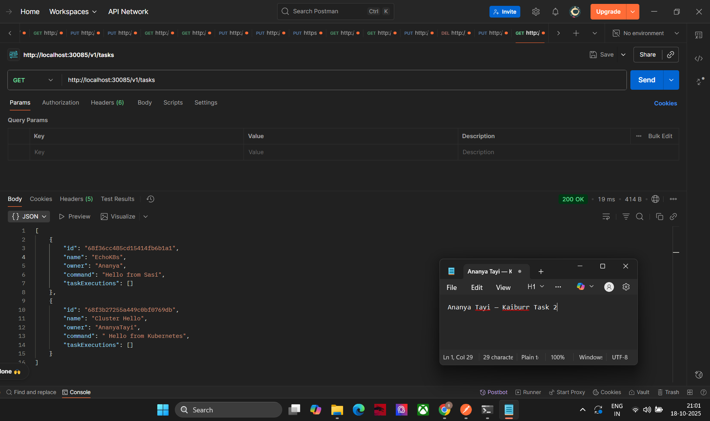
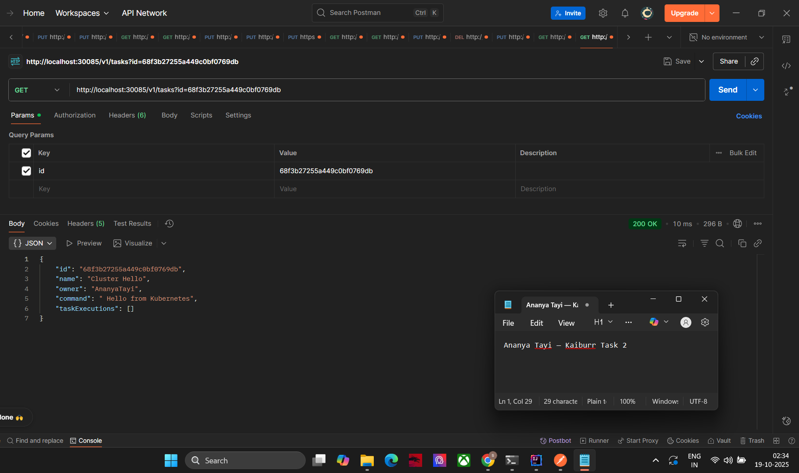
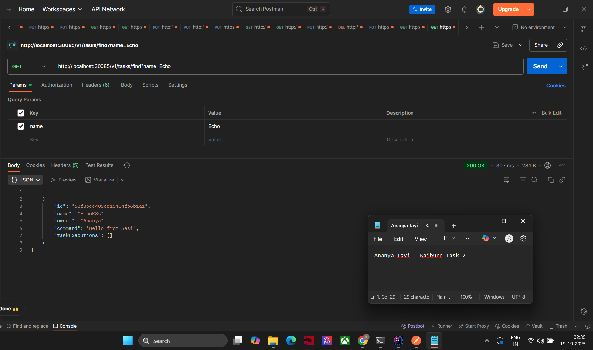

# 🧩 Task 2 – Kubernetes Deployment (Job Manager API)

## 📘 Overview
This project deploys a **Spring Boot REST API** (Job Manager) and **MongoDB** database on a **Kubernetes cluster**.  
It exposes the service via a **NodePort (30085)**, allowing CRUD operations on tasks stored in MongoDB and execution of shell commands within pods.

---

## ⚙️ Tech Stack
| Component | Description |
|------------|--------------|
| **Backend** | Java 21 (Spring Boot 3) |
| **Database** | MongoDB (K8s Deployment) |
| **Containerization** | Docker |
| **Orchestration** | Kubernetes (kubectl + Docker Desktop K8s) |
| **Build Tool** | Maven |

---

## 🚀 Setup & Deployment

### 1️⃣ Build JAR and Docker Image
```bash
mvn -q -DskipTests clean package
docker build -t jobmgr-api:v2 .
```

### 2️⃣ Deploy to Kubernetes
```bash
kubectl create ns jobmgr
kubectl apply -f k8s/mongo/mongo.yaml
kubectl apply -f k8s/app/rbac.yaml
kubectl apply -f k8s/app/app.yaml
```

### 3️⃣ Verify
```bash
kubectl get deploy,po,svc -n jobmgr
```
Expected → Both **jobmgr-api** and **mongo-db** pods in `Running` state.

---

## 🌐 Access the API
Service exposed at:  
`http://localhost:30085/v1/tasks`

---

## 🧠 API Endpoints Tested (via Postman)

| # | Method | Endpoint | Description |
|---|---------|-----------|--------------|
| 1 | **GET** | `/v1/tasks` | List all tasks |
| 2 | **GET** | `/v1/tasks?id=<id>` | Get task by ID |
| 3 | **GET** | `/v1/tasks/find?name=<keyword>` | Search tasks by name |
| 4 | **PUT** | `/v1/tasks/<id>/execution` | Execute task command inside Kubernetes pod |

---

## 🖼️ Screenshots (Postman)
**1️⃣ Get All Tasks**  


**2️⃣ Get Task by ID**  


**3️⃣ Find Task by Name**  



> Each screenshot includes system date/time and user name for authenticity.

---

## ✅ Verification Commands
```bash
kubectl get deploy,po,svc -n jobmgr
kubectl logs -n jobmgr deploy/jobmgr-api --tail=20
```

---

## 🏁 Conclusion
This task successfully demonstrates:
- Spring Boot microservice deployment on Kubernetes.  
- MongoDB backend connectivity via service DNS.  
- NodePort API accessibility and execution from pods.  
- Verified through Postman with four REST endpoints.
